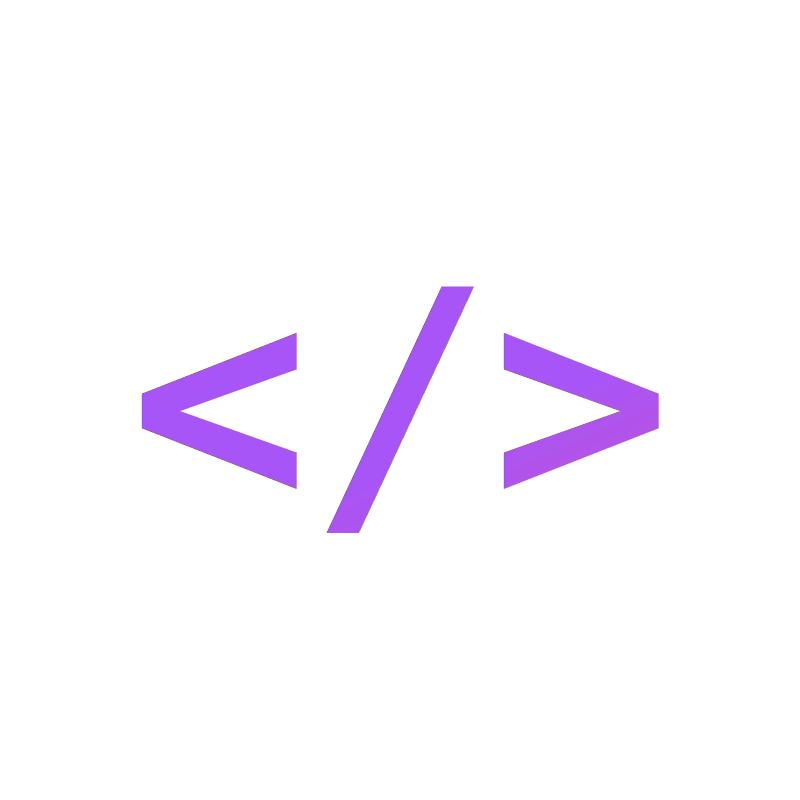
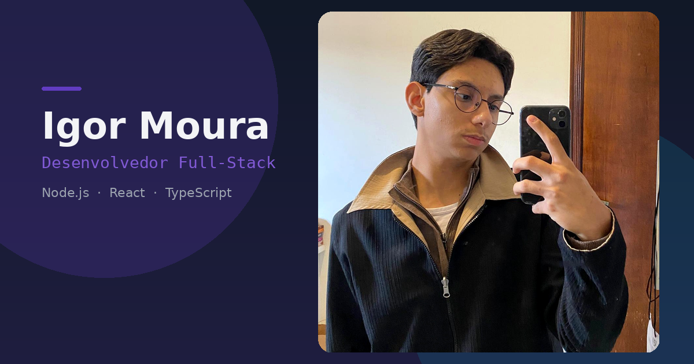

<div align="center">



# Portfólio — Igor Moura

[](https://git.io/typing-svg)

<br />

[](https://devigormoura.vercel.app/)
[](https://nextjs.org/)
[](https://react.dev/)
[](https://www.typescriptlang.org/)
[](https://tailwindcss.com/)
[](https://www.framer.com/motion/)

<br />

[](https://vercel.com/)
[](https://devigormoura.vercel.app/)
[](https://resend.com/)
[](#-licença)

<br />

[](https://devigormoura.vercel.app/)
[](https://github.com/igordmouraa/portfolio-igor/issues)
[](https://devigormoura.vercel.app/#contact)

<br />



<br />


</div>

---

## Índice

<table>
<tr>
<td>

**Navegação**

- [Funcionalidades](#-funcionalidades)
- [Stack](#-stack)
- [Como rodar](#-como-rodar)

</td>
<td>

**Conteúdo**

- [Estrutura](#-estrutura-do-projeto)
- [Adicionar conteúdo](#-adicionar-conteúdo)
- [Deploy](#-deploy)

</td>
</tr>
</table>

---

## Funcionalidades

<table>
<tr>
<td width="50%" valign="top">

 **Hero**

- Foto, roles rotativos e links sociais
- Partículas em canvas (aurora + conexões)
- Widget *now playing* via Last.fm *(opcional)*

 **Skills**

- Marquee duplo com ícones das techs
- Partículas de fundo na seção

 **Projetos**

- Slider horizontal — um projeto por vez
- Setas, dots, swipe e teclado `←` `→`
- Links para demo e repositório

</td>
<td width="50%" valign="top">

 **Experiência**

- Timeline animada com badges de stack
- Datas relativas localizadas (PT/EN)

 **Contato**

- Formulário com react-hook-form + zod
- Envio via Resend + toast de feedback

 **i18n & tema**

- PT-BR / EN-US com toggle no header
- Dark / light mode (next-themes)

 **Segurança**

- Rate limit, honeypot, CSP e headers HTTP
- `.env` fora do Git

</td>
</tr>
</table>

### Projetos em destaque

<table>
<tr>
<th align="center"></th>
<th align="left">Projeto</th>
<th align="center">Stack</th>
<th align="center">Demo</th>
</tr>
<tr>
<td align="center"></td>
<td align="left"><strong>Last.fm Weekly</strong><br/><sub>Cápsulas visuais semanais em Stories 9:16</sub></td>
<td align="center"></td>
<td align="center"><a href="https://lastfm-weekly.vercel.app/"></a></td>
</tr>
<tr>
<td align="center"></td>
<td align="left"><strong>PetExpress</strong><br/><sub>Gerenciador completo de pet shops</sub></td>
<td align="center"></td>
<td align="center"><a href="https://petexpress-typeblast.vercel.app/"></a></td>
</tr>
<tr>
<td align="center"></td>
<td align="left"><strong>Marvel Comics</strong><br/><sub>Explorador do universo Marvel</sub></td>
<td align="center"></td>
<td align="center"><a href="https://marvel-comics-lac.vercel.app/"></a></td>
</tr>
<tr>
<td align="center"></td>
<td align="left"><strong>Scaffold CLI</strong><br/><sub>Gerador de APIs multi-DB (MySQL, PG, Mongo)</sub></td>
<td align="center"></td>
<td align="center"><a href="https://www.npmjs.com/package/scaffold-api"></a></td>
</tr>
</table>

---

## Stack

<div align="center">


</div>

<br />

| | Camada | Tecnologia | Papel |
|:---:|:---|:---|:---|
|  | Framework | [Next.js 15](https://nextjs.org/) | App Router, SSR/SSG |
|  | UI | [React 19](https://react.dev/) | Componentes e hooks |
|  | Linguagem | [TypeScript](https://www.typescriptlang.org/) | Tipagem estática |
|  | Estilo | [Tailwind CSS](https://tailwindcss.com/) | Tokens semânticos light/dark |
|  | Motion | [Framer Motion](https://www.framer.com/motion/) | Animações e transições |
|  | Tema | [next-themes](https://github.com/pacocoursey/next-themes) | Alternância claro/escuro |
|  | E-mail | [Resend](https://resend.com/) | Formulário de contato |
|  | Forms | [react-hook-form](https://react-hook-form.com/) + [zod](https://zod.dev/) | Validação |

**Tipografia:** Outfit · DM Sans · IBM Plex Mono

---

## Como rodar

### Pré-requisitos

<p align="left">
 Node.js 18+ &nbsp;&nbsp;
 Yarn (recomendado)
</p>

### Instalação

```bash
git clone https://github.com/igordmouraa/portfolio-igor.git
cd portfolio-igor
yarn install
cp .env.example .env   # configure as variáveis
yarn dev               # → http://localhost:3000
```

### Variáveis de ambiente

| Variável | | Descrição |
|:---|:---:|:---|
| `RESEND_API_KEY` |  | Chave da API Resend |
| `CONTACT_EMAIL` |  | E-mail destino do formulário |
| `LASTFM_API_KEY` |  | API Last.fm — widget *now playing* |
| `LASTFM_USERNAME` |  | Usuário Last.fm (ex.: `igordmouraa`) |

<details>
<summary> <strong>Notas de desenvolvimento</strong></summary>

<br />

- Sem `RESEND_API_KEY`, o formulário retorna sucesso mas **descarta** a mensagem — nada é logado.
- Sem as variáveis Last.fm, o widget *now playing* no hero **fica oculto**.

</details>

### Scripts

| Comando | | Descrição |
|:---|:---:|:---|
| `yarn dev` |  | Servidor de desenvolvimento |
| `yarn build` |  | Build de produção |
| `yarn start` |  | Serve o build |
| `yarn lint` |  | ESLint |

---

## Estrutura do projeto

```
app/
├── api/contact/              # Route handler do formulário (Resend)
├── components/
│   ├── effects/              # ParticleBackground (canvas)
│   ├── layout/               # Header, Footer, Providers
│   ├── sections/home/
│   │   ├── hero-section/     # Hero (server) + hero-content (client)
│   │   ├── skills-section/
│   │   ├── projects-section/ # Slider + showcase por projeto
│   │   ├── experience-section/
│   │   └── contact-section/
│   └── ui/                   # Button, badges, cards…
├── i18n/
│   ├── LanguageContext.tsx
│   └── dictionaries/         # pt-BR.json · en-US.json
├── lib/
│   ├── projects.ts           # Metadados dos projetos
│   ├── experiences.ts
│   ├── techs.ts
│   ├── lastfm.ts             # Fetch server-side do now playing
│   └── utils.ts
├── globals.css               # Design tokens (light/dark)
├── layout.tsx
└── page.tsx

public/images/                # Screenshots e assets estáticos
middleware.ts                 # Rate limit da API de contato
next.config.js                # Headers de segurança (CSP, etc.)
```

---

## Adicionar conteúdo

<table>
<tr>
<td width="33%" align="center">

<br/>

**Projeto**

1. `app/lib/projects.ts`
2. Traduções → `projects[]`
3. Screenshot 16:10

</td>
<td width="33%" align="center">

<br/>

**Experiência**

1. `app/lib/experiences.ts`
2. Traduções → `experiences[]`

</td>
<td width="33%" align="center">

<br/>

**Skill**

1. `app/lib/techs.ts`
2. Aparece no marquee

</td>
</tr>
</table>

---

## Deploy

<div align="center">

[](https://vercel.com/new/clone?repository-url=https://github.com/igordmouraa/portfolio-igor)

</div>

<br />

| Variável | Ambiente |
|:---|:---|
| `RESEND_API_KEY` + `CONTACT_EMAIL` |  |
| `LASTFM_API_KEY` + `LASTFM_USERNAME` |  |

>  **Nunca** commite o arquivo `.env`.

---

## Licença

<div align="center">

Projeto pessoal — todos os direitos reservados.

<br />

Feito por **[Igor Moura](https://devigormoura.vercel.app/)**

<br />

[](https://github.com/igordmouraa)
[](https://www.linkedin.com/in/igordmoura/)
[](https://devigormoura.vercel.app/)
[](https://www.last.fm/user/igordmouraa)

</div>
